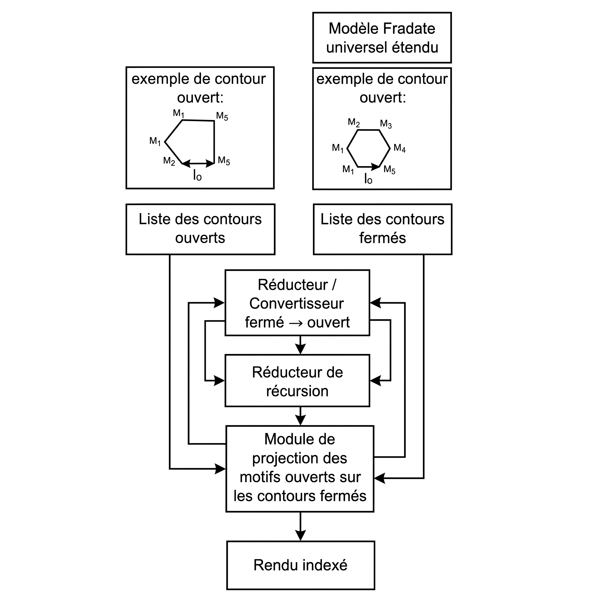

# Modèle fractal universel étendu

Moteur C++ de construction géométrique récursive combinant des **motifs ouverts**, des **contours fermés**, une réduction fermé-vers-ouvert et une rétrogradation adaptative des niveaux de substitution.

Ce repository prolonge le **Modèle fractal universel** : le modèle initial remplace chaque segment d'une chaîne par une transformation affine d'un même motif ; cette version étendue orchestre deux listes de géométries et fait du résultat d'un cycle la source du cycle suivant.

> Statut : prototype expérimental en cours de stabilisation. Le moteur fonctionne avec C++17, SFML 3 et des motifs décrits en JSON.



## Objectifs

Le projet cherche à séparer quatre responsabilités :

1. décrire les géométries indépendamment du rendu ;
2. projeter un motif ouvert sur les segments d'un chemin cible ;
3. convertir une géométrie fermée en nouveau motif ouvert ;
4. contrôler la croissance récursive par rétrogradation structurelle.

Cette séparation prépare plusieurs extensions : génération de SVG, export de maillages, reconstruction de sections 3D, intégration Blender et visualisation Three.js.

## Du modèle initial au modèle étendu

### Modèle fractal universel

Le modèle initial suit trois opérations :

```text
motif ouvert normalisé
        ↓
substitution de chaque segment
        ↓
nouvelle chaîne de segments
        ↓
itération récursive
```

Un point local `P(x, y)` est projeté sur un segment cible `[A, B]` à l'aide de la base :

```text
U = B - A
V = (-Uy, Ux)
```

La transformation affine est :

```text
P' = A + xU + yV
```

Le motif source commence en `(0,0)` et se termine en `(1,0)`. Son origine est donc projetée sur `A` et son dernier point sur `B`.

### Version étendue

La version étendue utilise deux collections ordonnées :

```text
OpenPatterns = [Eau, Feu, Vent, Bois, Terre, Glace, Magma, Foudre]

ClosedPaths = [
    Triangle,
    Carré,
    Pentagone,
    Hexagone,
    Heptagone,
    Octogone,
    Ennéagone,
    Décagone
]
```

Le premier motif ouvert remplace les segments du premier contour fermé. La géométrie obtenue est coupée, transformée en chemin ouvert, rétrogradée, puis combinée au motif ouvert suivant.

## Pipeline récursif

Pour un cycle d'indice `n` :

```text
CurrentMotif[n]
        +
ClosedPath[n]
        ↓
substitution géométrique
        ↓
ClosedGeometry[n]
        ↓
extraction de la première moitié
        ↓
HalfContour[n]
        ↓
rétrogradation de n niveaux
        ↓
ReducedHalf[n]
        ↓
normalisation entre (0,0) et (1,0)
        ↓
substitution par OpenPattern[n + 1]
        ↓
CurrentMotif[n + 1]
```

La récurrence peut être résumée par :

```text
G[n] = Substitute(CurrentMotif[n], ClosedPath[n])

H[n] = Normalize(ExtractHalf(G[n]))

R[n] = Normalize(Rollback(H[n], n))

CurrentMotif[n + 1] = Substitute(OpenPattern[n + 1], R[n])
```

## Réduction d'un contour fermé

`ContourReducer` convertit la nouvelle géométrie fermée en chemin ouvert.

Pour un nombre pair de segments, la première moitié est conservée :

```text
24 segments fermés
        ↓
12 segments ouverts
```

Pour un nombre impair, le nombre pair immédiatement inférieur est utilisé :

```text
21 segments fermés
        ↓
20 segments appairables
        ↓
10 segments ouverts
```

Le segment frontière non appairé est exclu. Le chemin résultant est ensuite normalisé afin que son origine soit `(0,0)` et son dernier point `(1,0)`.

## Rétrogradation récursive

La substitution augmente rapidement le nombre de segments et réduit progressivement la lisibilité des motifs. `RecursionReducer` réalise une dé-substitution structurelle : un groupe complet de segments enfants est remplacé par son segment parent.

```text
M segments enfants
        ↓
1 segment parent
```

La profondeur de rétrogradation suit l'indice du contour fermé :

| Contour | Cycle | Niveaux demandés |
|---|---:|---:|
| Triangle | 0 | 0 |
| Carré | 1 | 1 |
| Pentagone | 2 | 2 |
| Hexagone | 3 | 3 |
| Heptagone | 4 | 4 |
| Octogone | 5 | 5 |
| Ennéagone | 6 | 6 |
| Décagone | 7 | 7 |

Si une frontière interrompt un groupe de substitution, seuls les groupes complets sont conservés. Si le nombre de niveaux disponibles est inférieur au nombre demandé, le moteur retire uniquement les niveaux encore présents.

Cette opération n'est pas l'inverse analytique de la géométrie. Elle s'appuie sur l'historique des nombres de segments utilisés pendant les substitutions.

## Architecture C++

| Composant | Responsabilité |
|---|---|
| `Point` | Point identifié et coordonnées normalisées |
| `Segment` | Connectivité entre deux indices de points |
| `Pattern` | Représentation commune des motifs ouverts et fermés |
| `PolygonGenerator` | Chargement, tri et validation des polygones réguliers |
| `Transform` | Translation, rotation, échelle et projection affine |
| `GeometryMacro` | Substitution d'un motif ouvert sur un chemin cible |
| `ContourReducer` | Extraction et normalisation d'une moitié ouverte |
| `RecursionReducer` | Reconstruction des segments parents |
| `ProjectionEngine` | Orchestration des deux listes et historique des cycles |
| `Renderer` | Conversion écran et rendu SFML indexé |

## Arborescence

```text
modele-fractal-universel-etendu/
├── includes/
│   ├── Point.hpp
│   ├── Segment.hpp
│   ├── Pattern.hpp
│   ├── PolygonGenerator.hpp
│   ├── Transform.hpp
│   ├── GeometryMacro.hpp
│   ├── ContourReducer.hpp
│   ├── RecursionReducer.hpp
│   ├── ProjectionEngine.hpp
│   └── Renderer.hpp
├── source/
│   ├── main.cpp
│   ├── Pattern.cpp
│   ├── PolygonGenerator.cpp
│   ├── Transform.cpp
│   ├── GeometryMacro.cpp
│   ├── ContourReducer.cpp
│   ├── RecursionReducer.cpp
│   ├── ProjectionEngine.cpp
│   └── Renderer.cpp
├── patterns/
│   ├── openPath/
│   └── closePath/
├── docs/
│   └── images/
├── CMakeLists.txt
├── README.md
├── LICENSE
└── .gitignore
```

## Représentation JSON

Les motifs ouverts et fermés partagent la même organisation : paramètres, transformation écran, origine, points normalisés et segments ordonnés.

Un motif ouvert utilise :

```json
{
  "name": "wood-pattern",
  "element": "wood",
  "origin": "M0",
  "endPoint": "M8",
  "points": [],
  "segments": []
}
```

Un contour fermé remplace `element` par `closedPathType` :

```json
{
  "name": "hexagon-closed-path",
  "closedPathType": "hexagon",
  "origin": "M0",
  "endPoint": "M0",
  "points": [],
  "segments": [
    ["M0", "M1"],
    ["M1", "M2"],
    ["M2", "M3"],
    ["M3", "M4"],
    ["M4", "M5"],
    ["M5", "M0"]
  ]
}
```

Tous les polygones réguliers suivent les conventions suivantes :

- `M0` est l'origine locale et le début du parcours ;
- `M0 → M1` mesure `L` ;
- les sommets sont parcourus dans le sens antihoraire ;
- le dernier segment revient sur `M0`.

## Prérequis

- Windows 10 ou 11 ;
- Visual Studio Code ;
- extension CMake Tools ;
- compilateur compatible C++17 ;
- SFML 3.1.0 ;
- Git pour le chargement de `nlohmann/json` par CMake.

Le chemin SFML actuellement utilisé dans `CMakeLists.txt` est :

```text
D:/code/C++/libraries/SFML-3.1.0/lib/cmake/SFML
```

Adaptez cette valeur si SFML est installé ailleurs.

## Compilation dans Visual Studio Code

Le projet peut être configuré entièrement avec CMake Tools :

```text
Ctrl + Shift + P
→ CMake: Configure
→ CMake: Build
→ CMake: Run Without Debugging
```

Après l'ajout ou la suppression d'un fichier dans `CMakeLists.txt`, utilisez :

```text
CMake: Configure
CMake: Clean Rebuild
```

## Commandes du renderer

| Touche | Action |
|---|---|
| `1` | Afficher le contour fermé source |
| `2` | Afficher la géométrie fermée substituée |
| `3` | Afficher la moitié extraite et normalisée |
| `4` | Afficher le motif récursif suivant |
| `Tab` | Passer à l'état suivant du cycle |
| `→` ou `Espace` | Passer au cycle suivant |
| `←` | Revenir au cycle précédent |
| `A` | Activer ou arrêter l'animation |
| `R` | Revenir au premier cycle |
| `Échap` | Fermer la fenêtre |

Le titre de la fenêtre indique le cycle, le motif entrant, le contour fermé et l'état actuellement affiché.

## Limite de sécurité

Le nombre de segments peut croître rapidement. `ProjectionEngine` applique une limite configurable :

```cpp
ProjectionEngine engine(
    std::move(openPatterns),
    std::move(closedPaths),
    2'000'000
);
```

La rétrogradation adaptative réduit cette croissance, mais la limite reste nécessaire pour éviter une saturation de la mémoire pendant les expérimentations.

## Feuille de route

- stabiliser la rétrogradation sur les huit cycles ;
- ajouter l'affichage distinct de `ReducedHalf` ;
- enregistrer les statistiques de segments par cycle ;
- exporter les géométries en SVG ;
- comparer différentes stratégies de réduction ;
- relier des sections successives pour produire des maillages 3D ;
- proposer une implémentation indépendante du renderer SFML.

## Relation avec le repository initial

Ce projet est une extension du repository **Modèle fractal universel**. Le premier repository reste la référence pédagogique pour la substitution affine élémentaire et les implémentations multilangages.

Lien à compléter :

```text
URL_DU_REPOSITORY_MODELE_FRACTAL_UNIVERSEL
```

## Licence

Ce projet peut être distribué sous licence MIT. Ajoutez un fichier `LICENSE` avant la publication publique du repository.

